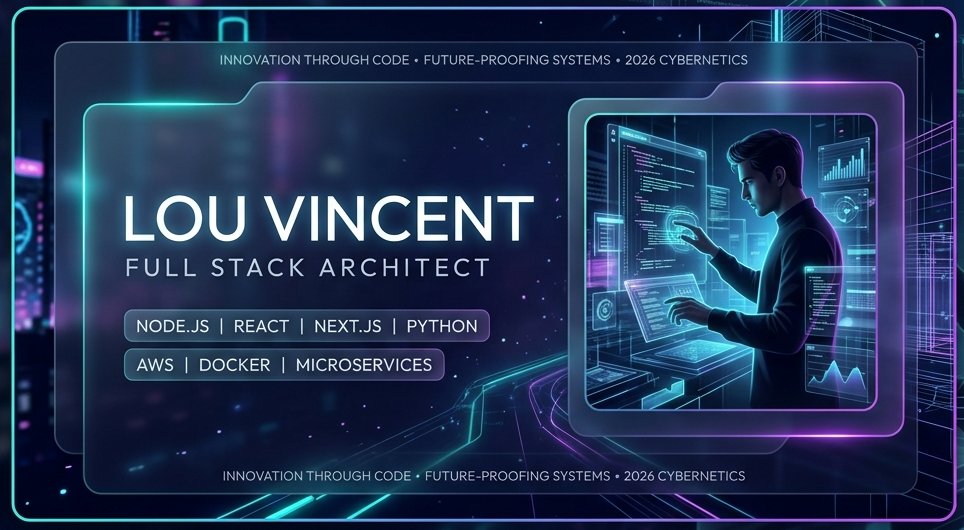
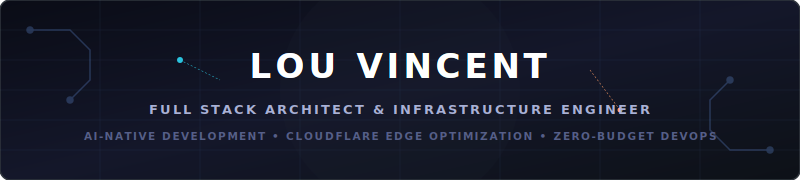
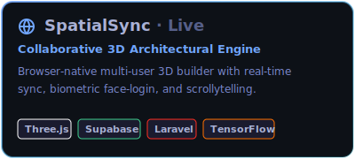
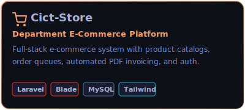
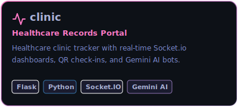
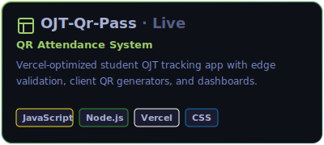
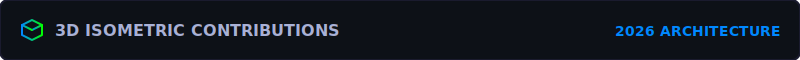
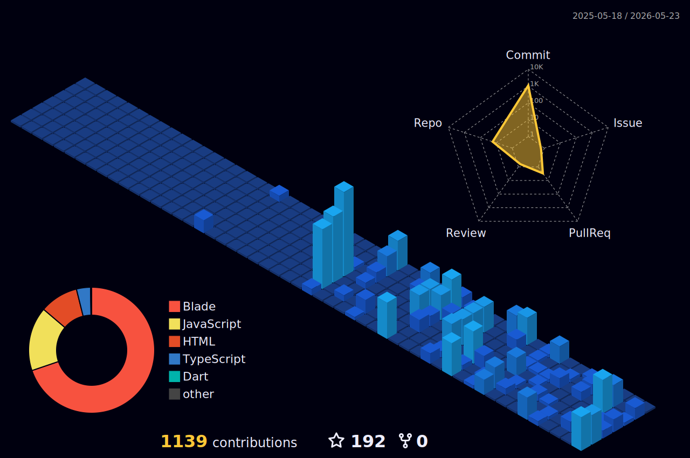

<!-- Main Premium Visual Banner -->

<!-- Animated cyber-grid header -->

  

 

&nbsp;
&nbsp;

 

I build **production-ready, SEO-optimized** web platforms, mobile apps, and AI engines — all deployed on **100% free-tier infrastructure** leveraging GitHub Student benefits, Cloudflare, and free-tier AI IDEs. **Every project is live. Zero dollars spent.**

 

<!-- ═══════════════════════════════════════════════════════ -->

**Languages**

 

**Frontend & Mobile**

 

**Backend & Databases**

 

**Cloud, DevOps & Tools**

 

**Edge & Realtime Databases**

**AI & Computer Vision**

<!-- ═══════════════════════════════════════════════════════ -->

  &nbsp;
    
  &nbsp;
  

 

<!-- Dropdown Accordions — Using  references (GitHub strips inline SVGs) -->

<picture></picture>

 

 
 
 
 
 
 
 
 

<picture></picture>

 

<picture></picture>

 

I leverage specialized AI agents and structured configuration parameters to build production systems rapidly:

<picture></picture>

 

My repositories run continuous automation pipelines that enforce code style, security standards, and smooth releases:

<!-- ═══════════════════════════════════════════════════════ -->

&nbsp;

  

<!-- ═══════════════════════════════════════════════════════ -->

<!-- ═══════════════════════════════════════════════════════ -->

 

*"Coding is no longer about syntax; it's about context, architecture, and orchestrating AI."*

 

