<!-- Animated neon banner -->
<picture>
  <source media="(prefers-color-scheme: dark)" srcset="assets/banner-v3.svg" />
  <source media="(prefers-color-scheme: light)" srcset="assets/banner-v3-light.svg" />
  
</picture>

  

 

<a href="https://louvincentbaroro.me">
  <picture>
  <source media="(prefers-color-scheme: dark)" srcset="assets/social-portfolio.svg" />
  <source media="(prefers-color-scheme: light)" srcset="assets/social-portfolio-light.svg" />
  
</picture>
</a>&nbsp;
<a href="https://www.linkedin.com/in/lou-vincent-baroro-7b4a9630b/">
  <picture>
  <source media="(prefers-color-scheme: dark)" srcset="assets/social-linkedin.svg" />
  <source media="(prefers-color-scheme: light)" srcset="assets/social-linkedin-light.svg" />
  
</picture>
</a>&nbsp;
<a href="https://profile.codersrank.io/user/dev-lou">
  <picture>
  <source media="(prefers-color-scheme: dark)" srcset="assets/social-codersrank.svg" />
  <source media="(prefers-color-scheme: light)" srcset="assets/social-codersrank-light.svg" />
  
</picture>
</a>&nbsp;
<a href="https://www.facebook.com/theunknownn30">
  <picture>
  <source media="(prefers-color-scheme: dark)" srcset="assets/social-facebook.svg" />
  <source media="(prefers-color-scheme: light)" srcset="assets/social-facebook-light.svg" />
  
</picture>
</a>&nbsp;
<a href="mailto:louvincentj@gmail.com">
  <picture>
  <source media="(prefers-color-scheme: dark)" srcset="assets/social-gmail.svg" />
  <source media="(prefers-color-scheme: light)" srcset="assets/social-gmail-light.svg" />
  
</picture>
</a>

 

  

    <b>CTO @ Syntaxure Labs &nbsp;|&nbsp; AI-Native Full-Stack Developer &nbsp;|&nbsp; Top 1% Worldwide</b>
  

  

    I build <b>production-ready, SEO-optimized</b> web platforms, mobile apps, and AI engines — all deployed on <b>100% free-tier infrastructure</b> leveraging GitHub Student benefits, Cloudflare, and free-tier AI IDEs. Every project is live. Zero dollars spent.  
    Officially ranked in the <b>Top 1% of Developers Worldwide</b> and <b>#23 in the Philippines</b> by CodersRank. Leading technical architecture and focusing on shipping scalable, production-ready systems that solve real business problems. View my full portfolio at <b>louvincentbaroro.me</b>.
  

 

<!-- ═══════════════════════════════════════════════════════ -->

<picture>
  <source media="(prefers-color-scheme: dark)" srcset="assets/header-techstack.svg?v=1779607917869" />
  <source media="(prefers-color-scheme: light)" srcset="assets/header-techstack-light.svg?v=1779607917869" />
  
</picture>

**Languages**

 

**Frontend & Mobile**

 

**Backend & Databases**

 

**Cloud, DevOps & Tools**

 

**Edge & Realtime Databases**

**AI & Computer Vision**

<!-- ═══════════════════════════════════════════════════════ -->

<picture>
  <source media="(prefers-color-scheme: dark)" srcset="assets/header-projects.svg?v=1779607917869" />
  <source media="(prefers-color-scheme: light)" srcset="assets/header-projects-light.svg?v=1779607917869" />
  
</picture>

  <a href="https://github.com/dev-lou/SpatialSync">
  <picture>
  <source media="(prefers-color-scheme: dark)" srcset="assets/project-spatialsync-v2.svg" />
  <source media="(prefers-color-scheme: light)" srcset="assets/project-spatialsync-v2-light.svg" />
  
</picture>
</a>&nbsp;
  <a href="https://github.com/dev-lou/Cict-Store">
  <picture>
  <source media="(prefers-color-scheme: dark)" srcset="assets/project-cictstore-v2.svg" />
  <source media="(prefers-color-scheme: light)" srcset="assets/project-cictstore-v2-light.svg" />
  
</picture>
</a>  
  <a href="https://github.com/dev-lou/clinic">
  <picture>
  <source media="(prefers-color-scheme: dark)" srcset="assets/project-clinic-v2.svg" />
  <source media="(prefers-color-scheme: light)" srcset="assets/project-clinic-v2-light.svg" />
  
</picture>
</a>&nbsp;
  <a href="https://github.com/dev-lou/OJT-Qr-Pass">
  <picture>
  <source media="(prefers-color-scheme: dark)" srcset="assets/project-ojt-v2.svg" />
  <source media="(prefers-color-scheme: light)" srcset="assets/project-ojt-v2-light.svg" />
  
</picture>
</a>

 

<!-- Dropdown Accordions — Using  references (GitHub strips inline SVGs) -->

<picture>
  <source media="(prefers-color-scheme: dark)" srcset="assets/summary-archive.svg?v=1779607917869" />
  <source media="(prefers-color-scheme: light)" srcset="assets/summary-archive-light.svg?v=1779607917869" />
  
</picture>

 

<a href="https://github.com/dev-lou/SpatialSync">
  <picture>
  <source media="(prefers-color-scheme: dark)" srcset="assets/archive-row-1.svg?v=1779607917869" />
  <source media="(prefers-color-scheme: light)" srcset="assets/archive-row-1-light.svg?v=1779607917869" />
  
</picture>
</a> 
<a href="https://github.com/dev-lou/Cict-Store">
  <picture>
  <source media="(prefers-color-scheme: dark)" srcset="assets/archive-row-2.svg?v=1779607917869" />
  <source media="(prefers-color-scheme: light)" srcset="assets/archive-row-2-light.svg?v=1779607917869" />
  
</picture>
</a> 
<a href="https://github.com/dev-lou/OJT-Qr-Pass">
  <picture>
  <source media="(prefers-color-scheme: dark)" srcset="assets/archive-row-3.svg?v=1779607917869" />
  <source media="(prefers-color-scheme: light)" srcset="assets/archive-row-3-light.svg?v=1779607917869" />
  
</picture>
</a> 
<a href="https://github.com/dev-lou/CICT-QR">
  <picture>
  <source media="(prefers-color-scheme: dark)" srcset="assets/archive-row-4.svg?v=1779607917869" />
  <source media="(prefers-color-scheme: light)" srcset="assets/archive-row-4-light.svg?v=1779607917869" />
  
</picture>
</a> 
<a href="https://github.com/dev-lou/clinic">
  <picture>
  <source media="(prefers-color-scheme: dark)" srcset="assets/archive-row-5.svg?v=1779607917869" />
  <source media="(prefers-color-scheme: light)" srcset="assets/archive-row-5-light.svg?v=1779607917869" />
  
</picture>
</a> 
<a href="https://github.com/dev-lou/PixelPilot">
  <picture>
  <source media="(prefers-color-scheme: dark)" srcset="assets/archive-row-6.svg?v=1779607917869" />
  <source media="(prefers-color-scheme: light)" srcset="assets/archive-row-6-light.svg?v=1779607917869" />
  
</picture>
</a> 
<a href="https://github.com/dev-lou/BaroroStudio">
  <picture>
  <source media="(prefers-color-scheme: dark)" srcset="assets/archive-row-7.svg?v=1779607917869" />
  <source media="(prefers-color-scheme: light)" srcset="assets/archive-row-7-light.svg?v=1779607917869" />
  
</picture>
</a> 
<a href="#">
  <picture>
  <source media="(prefers-color-scheme: dark)" srcset="assets/archive-row-8.svg?v=1779607917869" />
  <source media="(prefers-color-scheme: light)" srcset="assets/archive-row-8-light.svg?v=1779607917869" />
  
</picture>
</a> 
<a href="#">
  <picture>
  <source media="(prefers-color-scheme: dark)" srcset="assets/archive-row-9.svg?v=1779607917869" />
  <source media="(prefers-color-scheme: light)" srcset="assets/archive-row-9-light.svg?v=1779607917869" />
  
</picture>
</a>

<picture>
  <source media="(prefers-color-scheme: dark)" srcset="assets/summary-cloudflare.svg?v=1779607917869" />
  <source media="(prefers-color-scheme: light)" srcset="assets/summary-cloudflare-light.svg?v=1779607917869" />
  
</picture>

 

<picture>
  <source media="(prefers-color-scheme: dark)" srcset="assets/table-cloudflare.svg?v=1779607917869" />
  <source media="(prefers-color-scheme: light)" srcset="assets/table-cloudflare-light.svg?v=1779607917869" />
  
</picture>

<picture>
  <source media="(prefers-color-scheme: dark)" srcset="assets/summary-ai.svg?v=1779607917869" />
  <source media="(prefers-color-scheme: light)" srcset="assets/summary-ai-light.svg?v=1779607917869" />
  
</picture>

 

I leverage specialized AI agents and structured configuration parameters to build production systems rapidly:

<picture>
  <source media="(prefers-color-scheme: dark)" srcset="assets/table-ai.svg?v=1779607917869" />
  <source media="(prefers-color-scheme: light)" srcset="assets/table-ai-light.svg?v=1779607917869" />
  
</picture>

<picture>
  <source media="(prefers-color-scheme: dark)" srcset="assets/summary-devops.svg?v=1779607917869" />
  <source media="(prefers-color-scheme: light)" srcset="assets/summary-devops-light.svg?v=1779607917869" />
  
</picture>

 

My repositories run continuous automation pipelines that enforce code style, security standards, and smooth releases:

<picture>
  <source media="(prefers-color-scheme: dark)" srcset="assets/table-devops.svg?v=1779607917869" />
  <source media="(prefers-color-scheme: light)" srcset="assets/table-devops-light.svg?v=1779607917869" />
  
</picture>

<!-- ═══════════════════════════════════════════════════════ -->

<picture>
  <source media="(prefers-color-scheme: dark)" srcset="assets/header-analytics.svg?v=1779607917869" />
  <source media="(prefers-color-scheme: light)" srcset="assets/header-analytics-light.svg?v=1779607917869" />
  
</picture>

<picture>
  <source media="(prefers-color-scheme: dark)" srcset="https://streak-stats.demolab.com/?user=dev-lou&theme=tokyonight&hide_border=true&background=0d1117&ring=70a5fd&fire=bf91f3&currStreakLabel=70a5fd&sideLabels=a9b1d6&currStreakNum=a9b1d6&sideNums=a9b1d6&dates=545d7a" />
  <source media="(prefers-color-scheme: light)" srcset="https://streak-stats.demolab.com/?user=dev-lou&theme=github-light&hide_border=true&background=ffffff&ring=70a5fd&fire=bf91f3&currStreakLabel=70a5fd&sideLabels=24292f&currStreakNum=24292f&sideNums=24292f&dates=8b949e" />
  
</picture>
&nbsp;
<picture>
  <source media="(prefers-color-scheme: dark)" srcset="assets/top-languages.svg?v=1779607917869" />
  <source media="(prefers-color-scheme: light)" srcset="assets/top-languages-light.svg?v=1779607917869" />
  
</picture>

  

<picture>
  <source media="(prefers-color-scheme: dark)" srcset="https://github-readme-activity-graph.vercel.app/graph?username=dev-lou&bg_color=0d1117&color=70a5fd&line=bf91f3&point=70a5fd&area=true&area_color=1a1b2e&hide_border=true&custom_title=Contribution%20Graph" />
  <source media="(prefers-color-scheme: light)" srcset="https://github-readme-activity-graph.vercel.app/graph?username=dev-lou&bg_color=ffffff&color=70a5fd&line=bf91f3&point=70a5fd&area=true&area_color=e8ecf0&hide_border=true&custom_title=Contribution%20Graph" />
  
</picture>

<!-- ═══════════════════════════════════════════════════════ -->

<picture>
  <source media="(prefers-color-scheme: dark)" srcset="assets/header-achievements.svg?v=1779607917869" />
  <source media="(prefers-color-scheme: light)" srcset="assets/header-achievements-light.svg?v=1779607917869" />
  
</picture>

<picture>
  <source media="(prefers-color-scheme: dark)" srcset="https://github-profile-trophy.vercel.app/?username=dev-lou&theme=tokyonight&no-frame=true&no-bg=true&margin-w=6&row=1&column=7" />
  <source media="(prefers-color-scheme: light)" srcset="https://github-profile-trophy.vercel.app/?username=dev-lou&theme=flat&no-frame=false&no-bg=false&margin-w=6&row=1&column=7" />
  
</picture>

<!-- ═══════════════════════════════════════════════════════ -->

<picture>
  <source media="(prefers-color-scheme: dark)" srcset="assets/header-pacman.svg" />
  <source media="(prefers-color-scheme: light)" srcset="assets/header-pacman-light.svg" />
  
</picture>

<picture>
  <source media="(prefers-color-scheme: dark)" srcset="dist/pacman-contribution-graph-dark.svg" />
  <source media="(prefers-color-scheme: light)" srcset="dist/pacman-contribution-graph.svg" />
  
</picture>

 

<picture>
  <source media="(prefers-color-scheme: dark)" srcset="assets/footer-quote.svg?v=1779607917869" />
  <source media="(prefers-color-scheme: light)" srcset="assets/footer-quote-light.svg?v=1779607917869" />
  
</picture>

