<!-- Main Premium Visual Banner -->

<!-- 2026 Wow-Factor Animated visual cyber-grid header -->

  

 

 

I build **production-ready, SEO-optimized** web platforms, mobile apps, IoT systems, and AI engines — all deployed on **100% free-tier infrastructure** via GitHub Student benefits, Cloudflare, and strategic architecture. **Every project is live. Zero dollars spent.**

 

---

## Tech Stack

**Languages**

 

**Frontend & Mobile**

 

**Backend & Databases**

 

**Cloud, DevOps & Tools**

 

**Edge & Realtime Databases**

**AI & Computer Vision**

---

## Featured Projects

<table width="100%">
<tr>
<td width="50%" valign="top">

### 🌐 **[SpatialSync](https://github.com/dev-lou/SpatialSync)** · [↗ Live](https://spatialsync.isufstcict.com/)
*Collaborative 3D Architectural Engine*

Browser-native multi-user 3D builder with real-time sync, biometric face-login, and scroll-triggered transitions.

  
  
  
  

</td>
<td width="50%" valign="top">

### 🛒 **[Cict-Store](https://github.com/dev-lou/Cict-Store)**
*Department E-Commerce Platform*

Full-stack e-commerce system with product catalogs, order lifecycle queues, automated PDF invoicing, and secure Breeze auth.

  
  
  
  

</td>
</tr>
<tr>
<td width="50%" valign="top">

### 🏥 **[clinic](https://github.com/dev-lou/clinic)**
*Healthcare Records Portal*

Healthcare clinic tracker featuring real-time Socket.io dashboards, automated QR code check-ins, and Gemini AI chatbot integration.

  
  
  
  

</td>
<td width="50%" valign="top">

### 🎫 **[OJT-Qr-Pass](https://github.com/dev-lou/OJT-Qr-Pass)** · [↗ Live](https://ojt-qr.vercel.app)
*QR Attendance System*

Vercel-optimized student OJT tracking app with client QR generators, instant edge validation, and metrics dashboards.

  
  
  
  

</td>
</tr>
</table>

 

<!-- Dropdown Accordions using Inline Premium Interactive & Animated SVGs -->

  <svg xmlns="http://www.w3.org/2000/svg" width="100%" height="64" viewBox="0 0 800 64" fill="none" style="display: block;">
    <defs>
      <linearGradient id="bg-grad-1" x1="0%" y1="0%" x2="100%" y2="100%">
        <stop offset="0%" stop-color="#1f2335" />
        <stop offset="100%" stop-color="#16161e" />
      </linearGradient>
      <linearGradient id="blue-accent-1" x1="0%" y1="0%" x2="0%" y2="100%">
        <stop offset="0%" stop-color="#70a5fd" />
        <stop offset="100%" stop-color="#2ac3de" />
      </linearGradient>
      <filter id="glow-1" x="-20%" y="-20%" width="140%" height="140%">
        <feGaussianBlur stdDeviation="3" result="blur" />
        <feComposite in="SourceGraphic" in2="blur" operator="over" />
      </filter>
      
    </defs>
    <rect width="800" height="64" rx="8" fill="url(#bg-grad-1)" stroke="#30363d" stroke-width="1" />
    <rect class="accent-bar-1" width="4" height="64" rx="2" fill="url(#blue-accent-1)" />
    <g class="animated-icon-1" transform="translate(20, 20)" stroke="url(#blue-accent-1)" stroke-width="2" stroke-linecap="round" stroke-linejoin="round" fill="none">
      <path d="M22 19a2 2 0 0 1-2 2H4a2 2 0 0 1-2-2V5a2 2 0 0 1 2-2h5l2 3h9a2 2 0 0 1 2 2z" />
    </g>
    <text x="64" y="27" fill="#a9b1d6" font-family="-apple-system, BlinkMacSystemFont, 'Segoe UI', Roboto, sans-serif" font-size="13" font-weight="700" letter-spacing="1">SECONDARY &amp; ARCHIVED PROJECTS</text>
    <text x="64" y="45" fill="#565f89" font-family="-apple-system, BlinkMacSystemFont, 'Segoe UI', Roboto, sans-serif" font-size="10.5" font-weight="500" letter-spacing="0.5">21+ PHP Portals &amp; Legacy Systems  •  Full Academic suites &amp; web utilities</text>
    <g transform="translate(650, 19)">
      <rect class="pill-border-1" width="130" height="26" rx="13" fill="#1e2233" stroke="#2ac3de" stroke-width="1" filter="url(#glow-1)" />
      <text x="16" y="17" fill="#70a5fd" font-family="-apple-system, BlinkMacSystemFont, 'Segoe UI', Roboto, sans-serif" font-size="9.5" font-weight="700" letter-spacing="1">CLICK TO EXPAND</text>
      <path class="chevron-1" d="M110 9l4 4-4 4" stroke="#2ac3de" stroke-width="2" stroke-linecap="round" stroke-linejoin="round" fill="none" />
    </g>
  </svg>

 

| Project Repository | Core Technologies &amp; Stack | Deployment URL / Live Target | Description &amp; Scope |
|:---|:---|:---|:---|
| **[SpatialSync](https://github.com/dev-lou/SpatialSync)** | Laravel · Three.js · Supabase · TensorFlow | [spatialsync.isufstcict.com](https://spatialsync.isufstcict.com/) | 3D Architect engine, face-biometrics, scrollytelling |
| **[Cict-Store](https://github.com/dev-lou/Cict-Store)** | Laravel · Blade · MySQL · Tailwind | — | Department E-Commerce suite with PDF invoices |
| **[OJT-Qr-Pass](https://github.com/dev-lou/OJT-Qr-Pass)** | JavaScript · Node · Vercel | [ojt-qr.vercel.app](https://ojt-qr.vercel.app) | QR validation attendance dashboard |
| **[CICT-QR](https://github.com/dev-lou/CICT-QR)** | JavaScript · CSS | [cict-qr.vercel.app](https://cict-qr.vercel.app) | Real-time event check-in platform |
| **[clinic](https://github.com/dev-lou/clinic)** | Flask · Socket.IO · Python · Gemini | — | Clinic record portal with live AI chatbots |
| **[PixelPilot](https://github.com/dev-lou/PixelPilot)** | JavaScript · Gemini API | — | Dynamic layout generator and optimization engine |
| **[BaroroStudio](https://github.com/dev-lou/BaroroStudio)** | TypeScript · React | [baroro-studio.vercel.app](https://baroro-studio.vercel.app) | Fully interactive portfolio canvas |
| **Church-QR** | JavaScript · Web Cryptography | — | Safe community registration database |
| **21+ PHP Portals** | PHP · MySQL · Bootstrap | Various Local Intranets | Grading systems, faculty archives, student records |

  <svg xmlns="http://www.w3.org/2000/svg" width="100%" height="64" viewBox="0 0 800 64" fill="none" style="display: block;">
    <defs>
      <linearGradient id="bg-grad-2" x1="0%" y1="0%" x2="100%" y2="100%">
        <stop offset="0%" stop-color="#1f2335" />
        <stop offset="100%" stop-color="#16161e" />
      </linearGradient>
      <linearGradient id="cloudflare-accent-2" x1="0%" y1="0%" x2="0%" y2="100%">
        <stop offset="0%" stop-color="#ff9e64" />
        <stop offset="100%" stop-color="#ff79c6" />
      </linearGradient>
      <filter id="glow-2" x="-20%" y="-20%" width="140%" height="140%">
        <feGaussianBlur stdDeviation="3" result="blur" />
        <feComposite in="SourceGraphic" in2="blur" operator="over" />
      </filter>
      
    </defs>
    <rect width="800" height="64" rx="8" fill="url(#bg-grad-2)" stroke="#30363d" stroke-width="1" />
    <rect class="accent-bar-2" width="4" height="64" rx="2" fill="url(#cloudflare-accent-2)" />
    <g class="animated-icon-2" transform="translate(20, 20)" stroke="url(#cloudflare-accent-2)" stroke-width="2" stroke-linecap="round" stroke-linejoin="round" fill="none">
      <path d="M19 16.9A5 5 0 0 0 18 7h-1.26a8 8 0 1 0-11.62 8.58" />
      <polyline points="13 11 9 17 12 17 8 23" fill="url(#cloudflare-accent-2)" />
    </g>
    <text x="64" y="27" fill="#a9b1d6" font-family="-apple-system, BlinkMacSystemFont, 'Segoe UI', Roboto, sans-serif" font-size="13" font-weight="700" letter-spacing="1">CLOUDFLARE &amp; EDGE ARCHITECTURE</text>
    <text x="64" y="45" fill="#565f89" font-family="-apple-system, BlinkMacSystemFont, 'Segoe UI', Roboto, sans-serif" font-size="10.5" font-weight="500" letter-spacing="0.5">99.9% Cache Hit Rate  •  Edge compute  •  Zero-budget auto-scaling hosting strategies</text>
    <g transform="translate(650, 19)">
      <rect class="pill-border-2" width="130" height="26" rx="13" fill="#1e2233" stroke="#ff9e64" stroke-width="1" filter="url(#glow-2)" />
      <text x="16" y="17" fill="#ff9e64" font-family="-apple-system, BlinkMacSystemFont, 'Segoe UI', Roboto, sans-serif" font-size="9.5" font-weight="700" letter-spacing="1">CLICK TO EXPAND</text>
      <path class="chevron-2" d="M110 9l4 4-4 4" stroke="#ff9e64" stroke-width="2" stroke-linecap="round" stroke-linejoin="round" fill="none" />
    </g>
  </svg>

 

| Performance Layer | Operational Optimization Tactics | End-User Performance Impact | Server Infrastructure Cost |
|:---|:---|:---|:---|
| **Serverless &amp; CDN** | Cloudflare Pages &amp; Workers integration, Tiered Cache topologies, Smart Routing | Instant page loading, edge compilation, zero latency globally | **$0** *(100% Free Tier)* |
| **Asset Delivery** | Breadth Brotli/Gzip compression, HTTP/3 protocol, early static hints | Egress-free data transmission, minimal roundtrips | **$0** *(Bandwidth Exempt)* |
| **Edge Storage** | Edge DB drivers (Neon Serverless, Turso SQLite, Supabase Edge client) | Millisecond edge query speeds, globally synced state | **$0** *(Edge DB Tiers)* |
| **Edge Guarding** | Active edge WAF layers, automatic bot intercepts, TLS 1.3 enforced | Constant protection against DDoS, automatic zero-trust edge gates | **$0** *(Platform Standard)* |
| **Auto-Devops** | Automatic multi-branch staging environments via DNS routing integrations | Auto-provisioned sandbox environments on git push | **$0** *(Pipeline Built-in)* |

  <svg xmlns="http://www.w3.org/2000/svg" width="100%" height="64" viewBox="0 0 800 64" fill="none" style="display: block;">
    <defs>
      <linearGradient id="bg-grad-3" x1="0%" y1="0%" x2="100%" y2="100%">
        <stop offset="0%" stop-color="#1f2335" />
        <stop offset="100%" stop-color="#16161e" />
      </linearGradient>
      <linearGradient id="ai-accent-3" x1="0%" y1="0%" x2="0%" y2="100%">
        <stop offset="0%" stop-color="#bb9af7" />
        <stop offset="100%" stop-color="#ff007f" />
      </linearGradient>
      <filter id="glow-3" x="-20%" y="-20%" width="140%" height="140%">
        <feGaussianBlur stdDeviation="3" result="blur" />
        <feComposite in="SourceGraphic" in2="blur" operator="over" />
      </filter>
      
    </defs>
    <rect width="800" height="64" rx="8" fill="url(#bg-grad-3)" stroke="#30363d" stroke-width="1" />
    <rect class="accent-bar-3" width="4" height="64" rx="2" fill="url(#ai-accent-3)" />
    <g class="animated-icon-3" transform="translate(20, 20)" stroke="url(#ai-accent-3)" stroke-width="2" stroke-linecap="round" stroke-linejoin="round" fill="none">
      <rect x="4" y="4" width="16" height="16" rx="2" />
      <line x1="9" y1="1" x2="9" y2="4" />
      <line x1="15" y1="1" x2="15" y2="4" />
      <line x1="9" y1="20" x2="9" y2="23" />
      <line x1="15" y1="20" x2="15" y2="23" />
      <line x1="20" y1="9" x2="23" y2="9" />
      <line x1="20" y1="15" x2="23" y2="15" />
      <line x1="1" y1="9" x2="4" y2="9" />
      <line x1="1" y1="15" x2="4" y2="15" />
    </g>
    <text x="64" y="27" fill="#a9b1d6" font-family="-apple-system, BlinkMacSystemFont, 'Segoe UI', Roboto, sans-serif" font-size="13" font-weight="700" letter-spacing="1">AI-NATIVE DEVELOPMENT WORKFLOW</text>
    <text x="64" y="45" fill="#565f89" font-family="-apple-system, BlinkMacSystemFont, 'Segoe UI', Roboto, sans-serif" font-size="10.5" font-weight="500" letter-spacing="0.5">Agentic Pair Programming  •  Context Engineering  •  skills/rules context structures</text>
    <g transform="translate(650, 19)">
      <rect class="pill-border-3" width="130" height="26" rx="13" fill="#1e2233" stroke="#bb9af7" stroke-width="1" filter="url(#glow-3)" />
      <text x="16" y="17" fill="#bb9af7" font-family="-apple-system, BlinkMacSystemFont, 'Segoe UI', Roboto, sans-serif" font-size="9.5" font-weight="700" letter-spacing="1">CLICK TO EXPAND</text>
      <path class="chevron-3" d="M110 9l4 4-4 4" stroke="#bb9af7" stroke-width="2" stroke-linecap="round" stroke-linejoin="round" fill="none" />
    </g>
  </svg>

 

I leverage specialized AI agents and structured configuration parameters to build production systems rapidly:

| Development Tool | Specific Co-Pilot Role | Operational Execution Mode |
|:---|:---|:---|
| **Antigravity** | Autonomous Architect &amp; Agent | Executes sweeping directory overrides, multi-file code refactors, and automated verification tasks |
| **Cursor** | Context-Aware Inline Editor | Multi-file codebase index references (`@Codebase`), fast chat assistance, and structural rules |
| **Windsurf** | Terminal-Loop Optimizer | Closes the loop between file writes, CLI test suites, and fast iterative debugging cycles |
| **OpenCode** | Local Terminal Inference | Generates micro-scripts and parses local files without sending data to public clouds |
| **Zed** | High-Velocity Text Editor | Super-lightweight IDE footprint, ultra-fast file loading, and low-latency code writing |

  <svg xmlns="http://www.w3.org/2000/svg" width="100%" height="64" viewBox="0 0 800 64" fill="none" style="display: block;">
    <defs>
      <linearGradient id="bg-grad-4" x1="0%" y1="0%" x2="100%" y2="100%">
        <stop offset="0%" stop-color="#1f2335" />
        <stop offset="100%" stop-color="#16161e" />
      </linearGradient>
      <linearGradient id="devops-accent-4" x1="0%" y1="0%" x2="0%" y2="100%">
        <stop offset="0%" stop-color="#73daca" />
        <stop offset="100%" stop-color="#9ece6a" />
      </linearGradient>
      <filter id="glow-4" x="-20%" y="-20%" width="140%" height="140%">
        <feGaussianBlur stdDeviation="3" result="blur" />
        <feComposite in="SourceGraphic" in2="blur" operator="over" />
      </filter>
      
    </defs>
    <rect width="800" height="64" rx="8" fill="url(#bg-grad-4)" stroke="#30363d" stroke-width="1" />
    <rect class="accent-bar-4" width="4" height="64" rx="2" fill="url(#devops-accent-4)" />
    <g class="animated-icon-4" transform="translate(20, 20)" stroke="url(#devops-accent-4)" stroke-width="2" stroke-linecap="round" stroke-linejoin="round" fill="none">
      <polyline points="4 17 10 11 4 5" />
      <line x1="12" y1="19" x2="20" y2="19" />
    </g>
    <text x="64" y="27" fill="#a9b1d6" font-family="-apple-system, BlinkMacSystemFont, 'Segoe UI', Roboto, sans-serif" font-size="13" font-weight="700" letter-spacing="1">DEVOPS &amp; SUPPLY-CHAIN AUTOMATION</text>
    <text x="64" y="45" fill="#565f89" font-family="-apple-system, BlinkMacSystemFont, 'Segoe UI', Roboto, sans-serif" font-size="10.5" font-weight="500" letter-spacing="0.5">Husky pre-commit gates  •  Commitlint SemVer automations  •  Gitleaks credentials auditing</text>
    <g transform="translate(650, 19)">
      <rect class="pill-border-4" width="130" height="26" rx="13" fill="#1e2233" stroke="#73daca" stroke-width="1" filter="url(#glow-4)" />
      <text x="16" y="17" fill="#73daca" font-family="-apple-system, BlinkMacSystemFont, 'Segoe UI', Roboto, sans-serif" font-size="9.5" font-weight="700" letter-spacing="1">CLICK TO EXPAND</text>
      <path class="chevron-4" d="M110 9l4 4-4 4" stroke="#73daca" stroke-width="2" stroke-linecap="round" stroke-linejoin="round" fill="none" />
    </g>
  </svg>

 

My repositories run continuous automation pipelines that enforce code style, security standards, and smooth releases:

| Tooling Platform | Core DevSecOps Purpose | Automatic Pipeline Impact |
|:---|:---|:---|
| **Husky + lint-staged** | Git Pre-commit Lint Gates | Blocks malformed syntax, formatting drift, and console statements from being committed |
| **Commitlint** | Semantic Branch Validation | Restricts commits to the Conventional Commits specification to keep changelogs neat |
| **Changesets** | Release &amp; Changelog Automation | Tracks updates, auto-increments version tags (SemVer), and writes accurate changelogs |
| **CODEOWNERS** | Directory-Level Code Reviews | Instantly tags the responsible maintainers on pull requests based on modified file paths |
| **Gitleaks CI** | Zero-Cred Secrets Interceptor | Scrubs code pushes for private API keys, database strings, or accidental certificates |
| **Renovate Bot** | Secure Dependency Updates | Watches dependencies for CVEs, auto-merging safe patch bumps once tests clear |
| **Socket Security** | Supply-Chain Threat Blocker | Audits packages on install to catch malware, typo-squatting, or package hijackings |
| **Codium PR Agent** | Automated AI Code Reviewer | Drafts comprehensive PR summaries, test case recommendations, and code safety reviews |

---

## GitHub Analytics

&nbsp;

  

---

## Achievements

---

## Contribution Snake

<picture>
  <source media="(prefers-color-scheme: dark)" srcset="assets/github-snake-dark.svg" />
  <source media="(prefers-color-scheme: light)" srcset="assets/github-snake.svg" />
  
</picture>

 

*"First, solve the problem. Then, write the code."*

 

